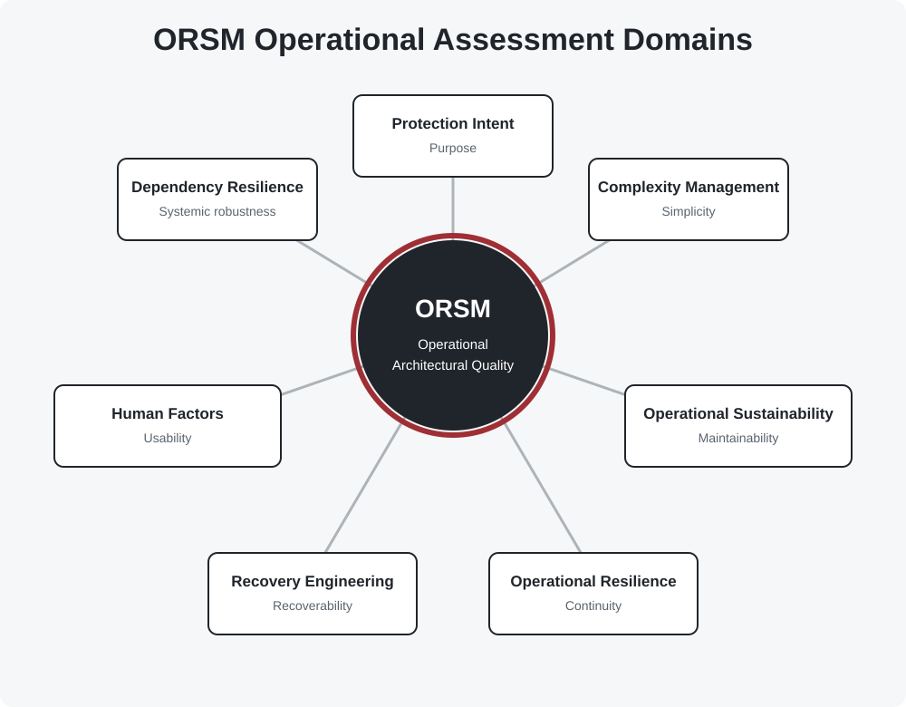

# Operational Assessment Domains

Security architecture cannot be evaluated through a single measure. ORSM
evaluates architecture across seven Operational Assessment Domains, each
examining a distinct characteristic of architectural quality.

## Domain 1 --- Protection Intent

**Characteristic:** Purpose

Verifies that every security capability exists for a clearly defined and
continuing business purpose, traceable to a protected asset, credible
threat and measurable objective.

## Domain 2 --- Complexity Management

**Characteristic:** Simplicity

Determines whether architectural complexity is understood, measured,
governed and actively managed as a finite organisational resource.

## Domain 3 --- Operational Sustainability

**Characteristic:** Maintainability

Evaluates whether the organisation possesses sufficient operational
capacity --- including skills, workload and technical debt --- to
sustain the architecture over its lifecycle.

## Domain 4 --- Operational Resilience

**Characteristic:** Continuity

Determines whether critical business services remain operational when
security capabilities fail or become unavailable.

## Domain 5 --- Recovery Engineering

**Characteristic:** Recoverability

Evaluates the organisation's ability to restore security capability
rapidly, repeatably and predictably following disruption.

## Domain 6 --- Human Factors

**Characteristic:** Usability

Evaluates whether security controls align with realistic operational
behaviour, considering friction, exception rates and bypass behaviour.

## Domain 7 --- Dependency Resilience

**Characteristic:** Systemic Robustness

Determines whether dependency concentration on shared platforms or
vendors introduces unacceptable operational or security risk.

------------------------------------------------------------------------

No single domain should be considered in isolation. Durable protection
depends on the architecture performing adequately across the model as a
whole.